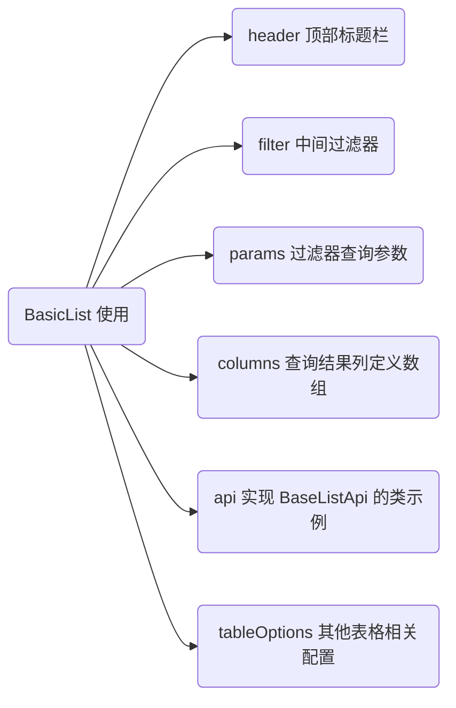

# 配置化列表

## 场景

解决重复的简单列表的编写，避免每次都手动控制过滤器/分页之类的东西，将之抽象成配置项，然后通过它进行生成。

## 理念

使用逐级递进的方式进行封装，使用者可以根据场景停留在一个合适的封装层次。

> 推荐大多数列表直接使用 `BasicList`，在不影响业务的前提下拒绝 UI/UX 与之前设计不一致的情况。

- `BasicList`：高层列表封装组件
  - `CommonListHeader`：列表页顶部工具栏组件
    - `CommonHeader`: 通用的顶部工具栏组件
  - `ListFilter`：过滤器组件
    - `FilterSelect`：单选过滤器
    - `FilterTimeRange`：时间区间过滤器
    - `BaseFilter`：基础过滤器，基于这个封装过滤器元素
  - `ListTable`：列表封装组件
    - `ListTable.mixin`：列表的数据/行为对象，可选择混入

## 组件依赖关系



## 基本使用

```tsx
import React, { useState } from 'react'
import { Moment } from 'moment'
import {
  FilterFieldSelect,
  FilterFieldTimeRange,
} from '../../../components/list/ts/FilterField'
import { filterSelectConstant } from '../../index/FilterSelect.constant'
import { filterConstant } from '../../../components/list/ts/filterConstant'
import { TableColumn } from '../../../components/list/ts/TableColumn'
import { Link } from 'react-router-dom'
import BasicList, {
  BasicListPropsType,
} from '../../../components/list/BasicList'
import { PermissionKeyEnum } from '../../base/router/ts/PermissionKeyEnum'
import {
  dealPermissionForArray,
  dealPermissionForObject,
} from '../../base/router/ts/hasPermission'
import { Button } from 'antd'
import { userApi } from './api/user.api'

type Config = BasicListPropsType & {
  params: {
    keyword?: string
    age?: number
    birthdayTimeBegin?: Moment
    birthdayTimeEnd?: Moment
  }
}
const UserList: React.FC = () => {
  const [config] = useState<Config>(
    dealPermissionForObject(
      {
        header: {
          title: '用户列表',
          placeholder: '用户名/住址',
          list: ['用户', '列表'],
        },
        filters: [
          new FilterFieldSelect({
            title: '年龄',
            field: 'age',
            values: filterSelectConstant.age,
          }),
          new FilterFieldTimeRange({
            title: '生日',
            fields: ['birthdayTimeBegin', 'birthdayTimeEnd'],
          }),
        ],
        params: {
          keyword: '搜索',
          age: filterConstant.CheckAllValue,
          birthdayTimeBegin: undefined,
          birthdayTimeEnd: undefined,
        },
        columns: dealPermissionForArray([
          new TableColumn({ field: 'id', title: 'ID' }),
          new TableColumn({ field: 'name', title: '姓名' }),
          new TableColumn({ field: 'birthday', title: '生日' }),
          [
            new TableColumn({
              field: 'operate',
              title: '操作',
              slot: (param: any) => (
                <Link to={`/system/user/${param.record.id}`}>详情</Link>
              ),
            }),
            PermissionKeyEnum.SystemUserDetail,
          ],
        ]),
        api: userApi,
        tableOperate: () => <Button>Excel 导出</Button>,
      } as Config,
      {
        tableOperate: PermissionKeyEnum.SystemUserExcel,
      },
    ),
  )
  return <BasicList {...config} />
}

export default UserList
```

## API

### BasicList

参考 _src/components/common/table/js/BasicListOptions.d.ts_

| `prop`           | 类型                     | 说明           |
| ---------------- | ------------------------ | -------------- |
| `header`         | `BasicList.Header`       | 标题栏相关配置 |
| `[filters]`      | `BaseFilterField[]`      | 过滤器列表     |
| `[params]`       | `BasicList.Params`       | 查询参数       |
| `columns`        | `TableColumn[]`          | 列字段列表     |
| `api`            | `BaseListApi`            | api 对象       |
| `[tableOptions]` | `BasicList.TableOptions` | 一些其他选项   |

### ListFilter

| `prop`    | 类型                | 说明       |
| --------- | ------------------- | ---------- |
| `[value]` | `BasicList.Params`  | 查询参数   |
| `filters` | `BaseFilterField[]` | 过滤器列表 |

### ListTable

| `prop`      | 类型                     | 说明         |
| ----------- | ------------------------ | ------------ |
| `columns`   | `TableColumn[]`          | 列字段列表   |
| `api`       | `BaseListApi`            | api 对象     |
| `params`    | `BasicList.Params`       | 查询参数     |
| `[options]` | `BasicList.TableOptions` | 一些其他选项 |

### 类型定义

下面是类型定义，所有的类型定义都有对应的 `.d.ts` 文件，请使用 `C-N` 搜索 `class`。

| `CommonHeaderNavItem` | 类型      | 说明                      |
| --------------------- | --------- | ------------------------- |
| `name`                | `string`  | 导航的名字                |
| `isRoute`             | `boolean` | 默认会赋值                |
| `[link]`              | `string`  | 如果是 route 的话必须有值 |

| `BasicList.Header` | 类型                    | 说明             |
| ------------------ | ----------------------- | ---------------- |
| `list`             | `CommonHeaderNavItem[]` | 导航元素列表     |
| `placeholder`      | `string`                | 搜索框的提示文本 |
| `title`            | `string`                | 标题             |

| `filterFieldType` | 类型 | 说明           |
| ----------------- | ---- | -------------- |
| `slot`            | `1`  | 自定义 slot    |
| `select`          | `2`  | 普通选择框     |
| `timeRange`       | `3`  | 日期区间选择器 |

| `BaseFilterField` | 类型              | 说明           |
| ----------------- | ----------------- | -------------- |
| `type`            | `filterFieldType` | 过滤器元素类型 |
| `title`           | `string`          | 过滤器的标题   |

| `BasicList.Params` | 类型     | 说明         |
| ------------------ | -------- | ------------ |
| `keyword`          | `string` | 查询关键字   |
| `...args`          | `any[]`  | 其他查询参数 |

| `TableColumn` | 类型                           | 说明                            |
| ------------- | ------------------------------ | ------------------------------- |
| `field`       | `string`                       | 在数据项中对应的字段名          |
| `title`       | `string`                       | 列标题                          |
| `[formatter]` | `(v: any, record: any) => any` | 自定义字段格式化函数            |
| `slot`        | `boolean`                      | 是否使用 slot，如果是，则值为？ |

| `BaseListApi` | 类型                                  | 说明                                       |
| ------------- | ------------------------------------- | ------------------------------------------ |
| `pageList`    | `(params: any) => Promise<Page<any>>` | 所有 ListTable 中的 api 对象必须实现该类型 |

| `TableOptions` | 类型      | 说明                   |
| -------------- | --------- | ---------------------- |
| `isSelect`     | `boolean` | 是否可选，默认为 false |
| `rowKey`       | `string`  | 行的唯一键，默认为 id  |
